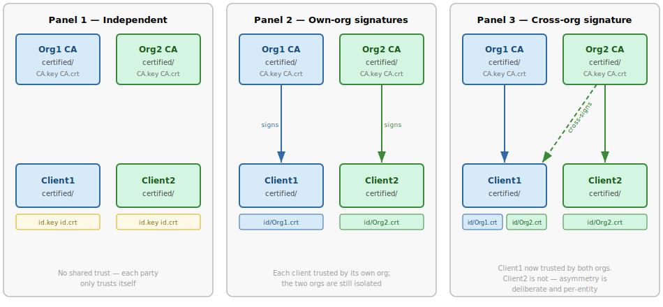

# Cross-chain Trust

When two organisations need to grant each other's clients selective access,
they can cross-sign individual identity certificates.  This page walks through
the full lifecycle: directory layout at each step, service definition files,
and how `Certified.Client` resolves and connects to a cross-org service.

## The three-step story



### Panel 1 — Independent parties

Each party has run `Certified.new()` and has its own `certified/` directory.
No cross-trust exists yet.

**Client1's directory:**
```
certified/
├── CA.key            # Client1's own CA private key
├── CA.crt            # Client1's own CA certificate
├── id.key            # Client1's identity private key
├── id.crt            # Client1's identity certificate (self-signed by CA)
├── known_servers/
│   └── self.crt      # Client1 trusts its own CA (created by Certified.new)
└── known_clients/
    └── self.crt      # Client1 accepts connections from itself
```

Client1 can only connect to services that trust its own CA.  Org2's services
will reject its certificate.

---

### Panel 2 — Own-org signatures

Org1's CA signs Client1's identity certificate and delivers the result.
Client1 receives Org1's service definition and stores it.

**Org1 runs** (signs Client1's `id.crt` and prints introduction JSON):
```bash
certified introduce client1_id.crt > intro.json
# Optionally add "services": {"org1-api": "https://api.org1.example:8443"}
# to the JSON before sending
```

**Client1 runs** (installs the introduction):
```bash
certified add-intro intro.json
# Saves id/<Org1-RFC4514-name>.crt and known_servers/org1-api.yaml
```

The equivalent Python calls:
```python
c = Certified()
c.add_identity(signed_cert, org1_ca_cert)   # saves id/Org1.crt
c.add_service("org1-api", org1_service_def) # saves known_servers/org1-api.yaml
```

!!! note "Why no explicit add-client step?"
    `introduce` signs Client1's cert using Org1's CA key.  Org1's server
    already has `known_clients/self.crt` — its own CA certificate — so any
    cert signed by that CA is automatically trusted for inbound connections.
    No separate `certified add-client` call is needed on Org1's side.
    This is intentional: running `introduce` is the act of granting inbound
    access.  Revocation means rotating the CA identity.

**Client1's directory after Panel 2:**
```
certified/
├── CA.key
├── CA.crt
├── id.key
├── id.crt
├── id/
│   └── Org1.crt          # PEM chain: id cert signed by Org1 CA
├── known_servers/
│   ├── self.crt
│   └── org1-api.yaml     # Org1's service definition
└── known_clients/
    └── self.crt
```

**`known_servers/org1-api.yaml`:**
```yaml
url: https://api.org1.example:8443
cert: <base64-DER Org1 CA certificate>
auths:
- CN=Org1 CA,O=Org1
```

`url` is the real network address. `cert` is the Org1 CA certificate to
verify the server's TLS certificate against. `auths` is the list of CA
subject names whose signatures Client1 should present when connecting
(matched against filenames in `id/`).

Client1 can now authenticate to Org1's services.  Org2 still rejects it.

---

### Panel 3 — Cross-org signature (asymmetric)

Org2 decides to grant Client1 access.  Org2's CA signs Client1's identity
certificate and delivers it along with Org2's service definition.  Client2
receives **no** reciprocal signature from Org1 — this asymmetry is
intentional and per-entity.

**Org2 runs:**
```bash
certified introduce client1_id.crt > intro2.json
# Add "services": {"org2-api": "https://api.org2.example:9443"} before sending
```

**Client1 runs:**
```bash
certified add-intro intro2.json
# Saves id/<Org2-RFC4514-name>.crt and known_servers/org2-api.yaml
```

The equivalent Python calls:
```python
c.add_identity(signed_cert, org2_ca_cert)   # saves id/Org2.crt
c.add_service("org2-api", org2_service_def) # saves known_servers/org2-api.yaml
```

**Client1's directory after Panel 3:**
```
certified/
├── CA.key
├── CA.crt
├── id.key
├── id.crt
├── id/
│   ├── Org1.crt          # PEM chain: signed by Org1 CA
│   └── Org2.crt          # NEW — PEM chain: signed by Org2 CA
├── known_servers/
│   ├── self.crt
│   ├── org1-api.yaml
│   └── org2-api.yaml     # NEW — Org2's service definition
└── known_clients/
    └── self.crt
```

**`known_servers/org2-api.yaml`:**
```yaml
url: https://api.org2.example:9443
cert: <base64-DER Org2 CA certificate>
auths:
- CN=Org2 CA,O=Org2
```

Client1 can now authenticate to both Org1 and Org2's services.

---

## How `Certified.Client` resolves a connection

When Client1 makes a request to an aliased service name, `Certified.Client`
performs three steps automatically.

### Step 1 — Alias lookup (netloc → service definition)

```python
with c.Client("https://org2-api/some/path") as http:
    resp = http.get("/endpoint")
```

`urlparse("https://org2-api/some/path")` extracts `hostname = "org2-api"`.

`Certified.lookup_server("org2-api")` reads
`known_servers/org2-api.yaml` and returns a `TrustedService` object:

```
TrustedService(
    url   = "https://api.org2.example:9443",
    cert  = "<b64-DER Org2 CA cert>",
    auths = ["CN=Org2 CA,O=Org2"],
)
```

`replace_baseurl(url, srv.url)` rewrites the request URL to
`https://api.org2.example:9443/some/path`.  The alias `org2-api` is never
sent on the wire.

### Step 2 — Client certificate selection

`ssl_context(is_client=True, srv=org2_service)` calls
`get_chain_from(["CN=Org2 CA,O=Org2"])`.

`get_chain_from` scans `id/` for a file whose stem matches an entry in
`auths`:

1. Finds `id/Org2.crt` → stem `"Org2"` … wait, stems are RFC 4514 names.

!!! note
    `add_identity` names the file using `rfc4514name(ca_cert.subject)`, so
    the filename is the full RFC 4514 distinguished name of the signing CA
    (e.g. `CN=Org2 CA,O=Org2.crt`).  The `auths` list in the service
    definition must use the same format.

`get_chain_from` returns `(id/Org2.crt bytes, b"")` — the leaf cert is
already the signed chain; no additional intermediate is needed.

### Step 3 — SSL context assembly

The SSL context is built with:

- **Client certificate**: `id.key` + the PEM chain from `id/Org2.crt`
- **Server CA**: the specific `cert` from the service definition (Org2's CA),
  loaded via `ctx.load_verify_locations(cadata=pem)`.  Using a pinned CA
  (rather than the whole `known_servers/` directory) means the TLS handshake
  will only accept *this exact server CA* — a tighter trust anchor.

The resulting `ssl.SSLContext` is passed to `httpx.Client(verify=ssl_ctx)`.
During the TLS handshake:

- Client presents `id.key` + `id/Org2.crt` → Org2's server verifies this
  against its `known_clients/` directory.
- Server presents its cert → Client verifies it against the pinned Org2 CA.

After the handshake, mTLS is established and the request proceeds to
`https://api.org2.example:9443/some/path`.  What Client1 is then *allowed*
to do is up to Org2's authorisation policy — see [Authorization Model](authz.md).
